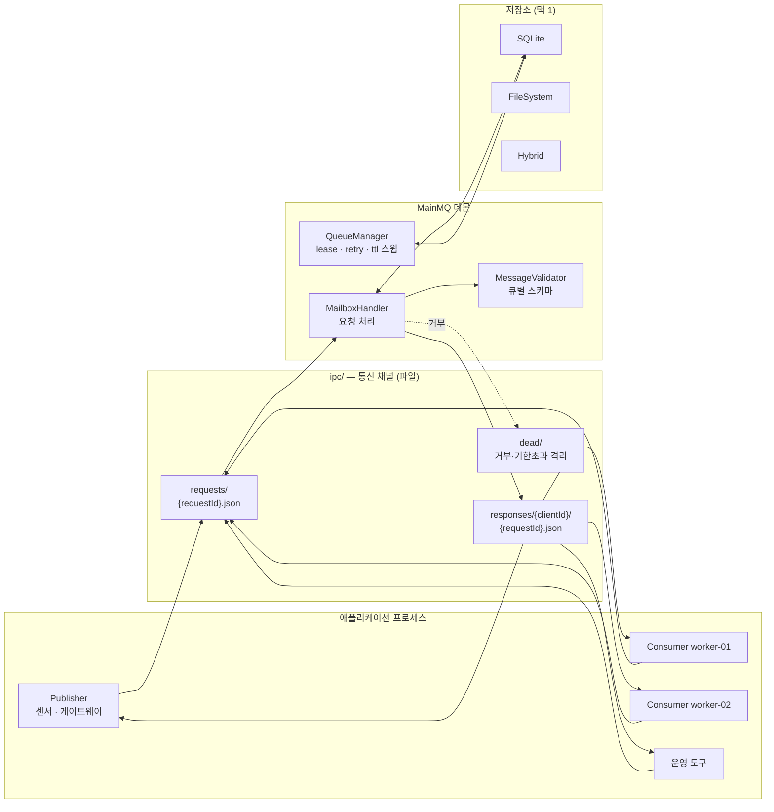
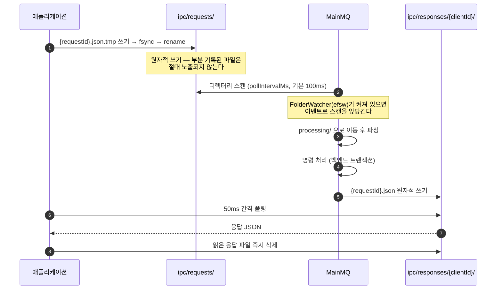
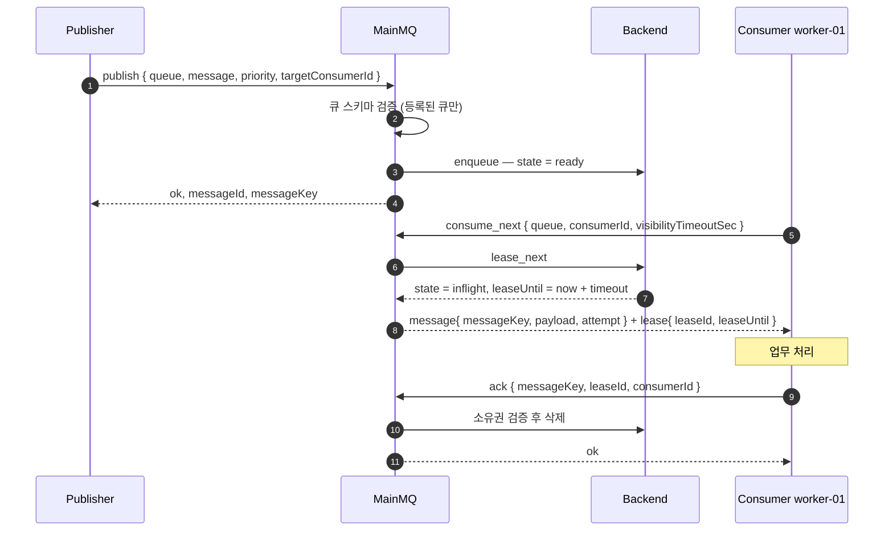
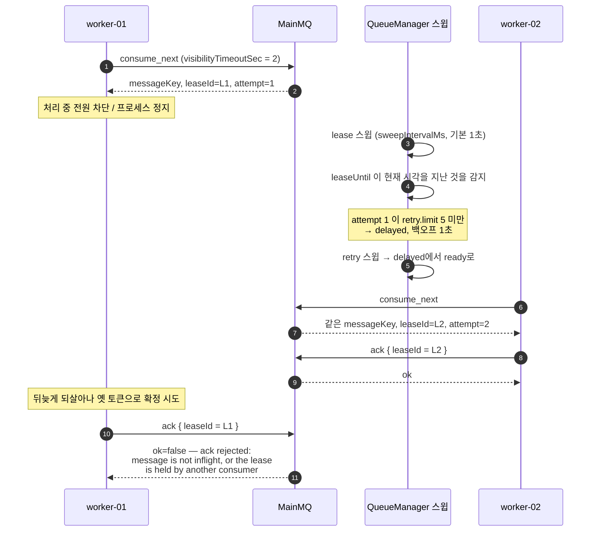
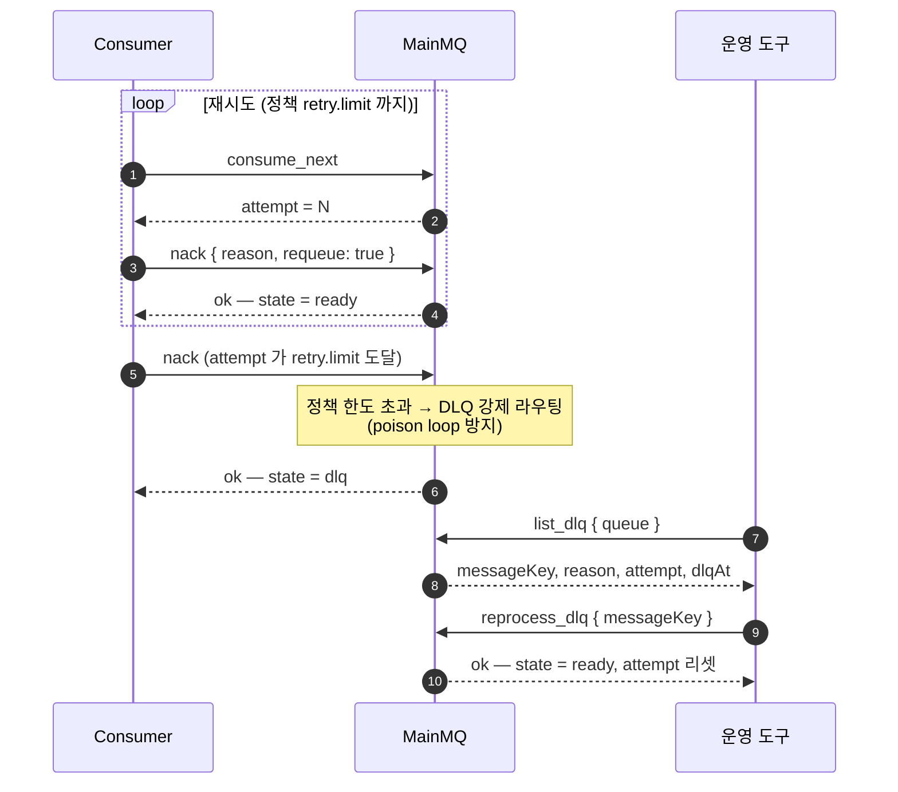
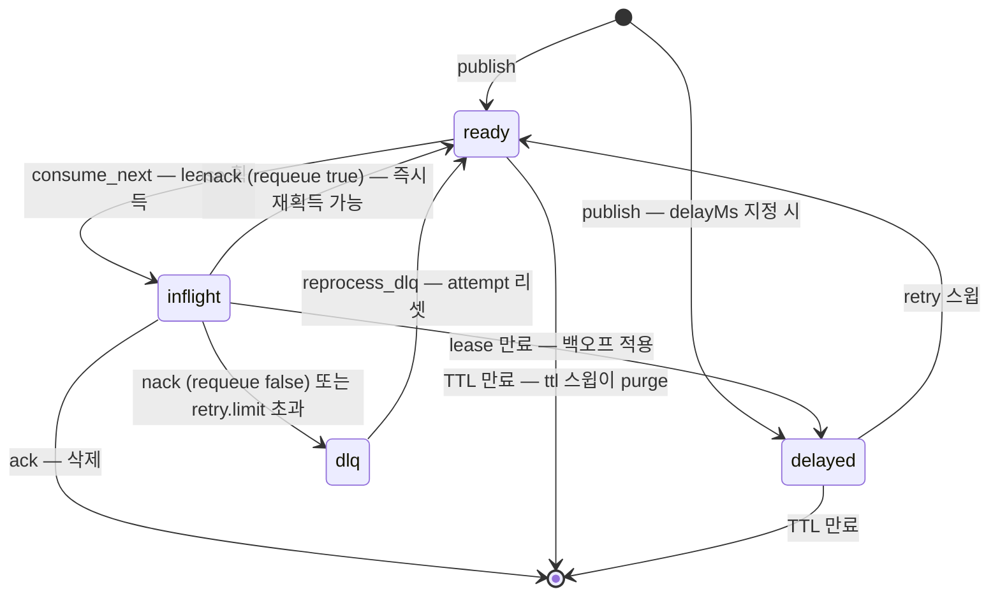

# Yi-Rang MQ

**레거시 임베디드 환경을 위한 경량 메시지 큐 데몬**

[](https://en.cppreference.com/w/cpp/23)
[](LICENSE)

---

## 무엇인가

Yi-Rang MQ는 **파일 시스템만으로 동작하는 메시지 큐 데몬**입니다. 프로세스 간 통신을 TCP/IP 없이 디렉터리에 JSON 파일을 주고받는 방식으로 처리하고, 메시지의 상태(대기 / 처리 중 / 재시도 / 격리)는 SQLite 또는 파일 시스템에 영속화합니다.

SQS의 사용 모델 — 발행, 소비, 가시성 타임아웃, 재시도, 데드레터 큐 — 를 그대로 가져오면서, 브로커 프로세스 하나와 JSON 설정 파일 하나로 끝나도록 만들었습니다.

```
바이너리 3개 · 런타임 의존성 2개(libsqlite3, liblz4) · 네트워크 포트 0개
```

## 왜 필요한가

산업용 장비나 레거시 임베디드 시스템에서 프로세스가 셋을 넘어가면 IPC는 빠르게 스파게티가 됩니다. 그런데 RabbitMQ나 Kafka를 붙이자니 브로커가 장비보다 무겁고, JVM이나 Erlang 런타임을 올릴 수 없는 환경도 여전히 많습니다. TCP/IP 스택 자체가 없는 장비도 있습니다.

그래서 직접 만들게 됩니다. "디렉터리에 파일을 떨궈서 큐로 쓰면 되지 않나?" — 만들 수 있습니다. 문제는 그 다음입니다.

- 소비자가 파일을 집어 든 채로 전원이 끊기면?
- 두 소비자가 같은 파일을 동시에 집으면?
- 몇 번 실패하면 포기해야 하나?
- 포기한 메시지는 어디에 쌓이나?

Yi-Rang MQ는 이 네 가지에 답하기 위한 최소한의 장치만 갖췄습니다.

| 문제 | 해결 방식 |
|------|-----------|
| 네트워크 스택 없음 | 파일 기반 Mailbox IPC — 소켓·포트·방화벽 설정 없음 |
| 저사양 디바이스 | SQLite 또는 순수 파일 시스템, 런타임 의존성 2개 |
| 전원 차단 / 재시작 | Lease 만료 자동 회수 + 지수 백오프 재시도 + DLQ 격리 |
| 중복 처리 위험 | Lease 토큰 검증(fencing) — 만료된 소유권의 확정은 거부 |
| 복잡한 브로커 설정 | JSON 설정 파일 하나, 즉시 기동 |
| 현장 디버깅 | `ls`와 `cat`으로 메시지와 상태를 직접 확인 |

---

## 시스템 구성



네트워크 요소가 하나도 없습니다. 참여자 전원이 같은 디렉터리 트리를 보는 것이 통신의 전부입니다.

---

## 동작 방식

### 1. 요청 한 번의 실제 왕복

모든 명령이 동일한 경로를 지납니다. 쓰기는 양방향 모두 `임시파일 → fsync → rename → 부모 디렉터리 fsync` 순서이므로, 어느 시점에 전원이 끊겨도 반쯤 쓰인 파일이 상대에게 보이지 않습니다.



응답 봉투는 성공과 실패의 형태가 다릅니다.

```json
// 성공 — error 키가 없다
{ "requestId": "3F2A-...", "ok": true,  "data": { "messageId": "...", "messageKey": "msg:telemetry:..." } }

// 실패 — data 키가 없다
{ "requestId": "3F2A-...", "ok": false, "error": { "code": "ERR_VALIDATION_FAILED", "message": "field 'deviceId' is required" } }
```

### 2. 발행과 소비 확정



큐가 비어 있을 때 `consume_next`는 **오류가 아니라** `ok: true` + `data.message: null`을 돌려줍니다. 롱폴링이 없으므로 소비자는 자체 폴링 루프를 돕니다.

### 3. 소비자 장애와 자동 복구 — 실무에서 가장 중요한 경로

소비자가 메시지를 물고 죽어도 메시지는 사라지지 않습니다. 데몬의 스윕 워커가 만료된 lease를 회수해 다른 소비자에게 재배달합니다. 뒤늦게 되살아난 소비자가 옛 lease로 확정을 시도하면 **거부**되므로, 같은 작업이 두 번 반영되지 않습니다.



재배달까지 걸리는 시간은 `가시성 타임아웃 + lease 스윕 주기(≤1초) + 백오프 + retry 스윕 주기(≤1초)`입니다. 위 예시(가시성 2초, 백오프 초기값 1초)에서는 통상 3~5초입니다.

### 4. 재시도 소진과 DLQ, 그리고 재처리



`nack`의 `requeue`는 **기본값이 false**입니다. 생략하면 재시도 없이 곧바로 DLQ로 갑니다. 재시도를 원하면 명시해야 합니다.

### 5. 메시지 상태 전이



`nack requeue=true`는 백오프 없이 즉시 `ready`가 되고, 백오프는 **lease 만료 경로에만** 적용됩니다. 재시도 간격을 두려면 lease 만료에 맡기거나 애플리케이션에서 대기하십시오.

---

## Quick Start

### Docker (권장)

```bash
git clone https://github.com/ngee044/yirang-message-queue.git
cd yirang-message-queue/docker

./docker-compose.sh up
./docker-compose.sh health
./docker-compose.sh publish telemetry '{"deviceId":"sensor-01","timestamp":1700000000,"temp":25.5}'
./docker-compose.sh consume telemetry
./docker-compose.sh down
```

### 로컬 빌드

요구사항: CMake 3.21+, C++23 컴파일러(GCC 13+ / Clang 16+), vcpkg

```bash
./build.sh

# 터미널 1 — 데몬
cd build/out && ./MainMQ

# 터미널 2 — 발행
cd build/out && ./yirangmq-cli-publisher --message '{"deviceId":"sensor-01","timestamp":1700000000,"temp":25.5}'

# 터미널 3 — 소비
cd build/out && ./yirangmq-cli-consumer consume --consumer-id worker-01
```

> **`build/out`에서 실행하십시오.** IPC 루트(`./ipc`)는 실행 시 작업 디렉터리 기준 상대 경로입니다. 다른 위치에서 실행하면 데몬과 다른 디렉터리를 보게 되어, 오류 없이 타임아웃만 발생합니다. 위치를 바꿔야 한다면 `--ipc-root`로 명시하십시오.

### 임베디드 타깃 크로스컴파일

```bash
./build.sh -m --static \
  --triplet arm64-linux \
  --toolchain /path/to/arm64-toolchain.cmake

# 또는 Docker buildx로 배포용 이미지 크로스 빌드 (QEMU, 느림)
cd docker && ./docker-compose.sh buildx linux/arm64
```

| 옵션 | 의미 |
|------|------|
| `--triplet` | vcpkg 타깃 triplet(`arm64-linux`, `arm-linux` 등). 의존성이 타깃 아키텍처로 빌드된다 |
| `--toolchain` | CMake 크로스 툴체인 파일. vcpkg가 chainload하며 타깃 컴파일러·시스루트를 지정 |
| `--static` | 런타임 정적 링크 — glibc/musl 버전 비의존, 구형 임베디드 배포에 유용 |
| `-m` / `--minsize` | MinSizeRel — 최소 크기 바이너리 |

---

## 사용법

### 데몬

```bash
cd build/out
./MainMQ
```

기동 로그(각 줄에 `[타임스탬프][레벨]` 접두사가 붙습니다):

```
[START]
[INFORMATION] Yi-Rang MQ starting...
[INFORMATION] Backend: SQLite
[INFORMATION] Node ID: local-01
[INFORMATION] Backend initialized successfully
[INFORMATION] Registered queue: telemetry
[INFORMATION] QueueManager started
[INFORMATION] Registered message schema 'TelemetryMessage' for queue 'telemetry'
[INFORMATION] FolderWatcher started on: ./ipc/requests
[INFORMATION] MailboxHandler started (root: ./ipc, mode: event-driven)
[INFORMATION] Operation mode: mailbox_sqlite
[INFORMATION] Yi-Rang MQ is running. Press Ctrl+C to stop.
```

확인할 지점 두 가지입니다.

- `Registered queue:` 와 `Registered message schema ... for queue` 가 찍히지 않으면 그 큐는 `queues[]`에 등록되지 않은 상태이며, 스키마 검증과 큐별 정책이 적용되지 않습니다.
- `mode: polling`으로 찍히면 파일 이벤트 대신 주기 스캔으로 동작합니다. Docker 볼륨에서는 efsw가 이벤트를 받지 못하므로 이 모드를 씁니다.

설정 파일은 **실행 파일과 같은 디렉터리**에서 `main_mq_configuration.json`을 읽습니다. 경로를 지정하는 옵션은 없고, 주요 값은 명령행으로 덮어쓸 수 있습니다.

```bash
./MainMQ --backend filesystem --db-path ./data/other.db --data-root ./data2 \
         --log-root ./logs2 --node-id edge-07 --visibility-timeout 60 \
         --write-console-log 3 --write-file-log 3
```

### 발행

기본 큐 `telemetry`에는 스키마가 등록되어 있습니다 — `deviceId`는 필수이며 문자열, `timestamp`는 있으면 숫자여야 합니다. 위반하면 `ERR_VALIDATION_FAILED`로 거부됩니다.

```bash
cd build/out

# 헬스 체크
./yirangmq-cli-publisher health

# 발행 (publish 명령 생략 가능)
./yirangmq-cli-publisher --message '{"deviceId":"sensor-01","timestamp":1700000000,"temp":25.5}'

# 큐 지정
./yirangmq-cli-publisher --queue telemetry --message '{"deviceId":"humidity-01","timestamp":1700000000,"humidity":65}'

# 특정 Consumer에게만 배달
./yirangmq-cli-publisher --message '{"deviceId":"sensor-01","timestamp":1700000000,"alert":"high"}' --target worker-01

# 우선순위 (클수록 먼저 배달, 기본 0)
./yirangmq-cli-publisher --message '{"deviceId":"sensor-01","timestamp":1700000000,"urgent":true}' --priority 10

# 지연 발행 (5초 후 ready)
./yirangmq-cli-publisher --message '{"deviceId":"sensor-01","timestamp":1700000000,"scheduled":true}' --delay 5000

# 큐 상태 / 서버 메트릭
./yirangmq-cli-publisher status --queue telemetry
./yirangmq-cli-publisher metrics
```

### 소비와 확정

```bash
cd build/out

# 소비 (consume 생략 가능)
./yirangmq-cli-consumer consume --queue telemetry --consumer-id worker-01
```

응답에서 `messageKey`와 `leaseId`를 받습니다.

```json
{
  "ok": true,
  "data": {
    "message": {
      "messageId": "3F2A-91C4-77B0-D18E-5A6C",
      "messageKey": "msg:telemetry:3F2A-91C4-77B0-D18E-5A6C",
      "queue": "telemetry",
      "payload": { "deviceId": "sensor-01", "timestamp": 1700000000, "temp": 25.5 },
      "priority": 0,
      "attempt": 1,
      "createdAt": 1754280000123
    },
    "lease": {
      "leaseId": "8C11-4D07-2B93-E5FA-6019",
      "messageKey": "msg:telemetry:3F2A-91C4-77B0-D18E-5A6C",
      "consumerId": "worker-01",
      "leaseUntil": 1754280030123
    }
  }
}
```

확정은 **lease를 보유한 consumer만** 할 수 있습니다. `--consumer-id`는 소비할 때와 같은 값이어야 하고, `--lease-id`를 함께 주면 만료·재리스된 stale 토큰까지 차단됩니다.

```bash
# 처리 성공
./yirangmq-cli-consumer ack \
  --message-key msg:telemetry:3F2A-91C4-77B0-D18E-5A6C \
  --lease-id 8C11-4D07-2B93-E5FA-6019 --consumer-id worker-01

# 처리 실패 — 재시도 (--requeue 없으면 곧바로 DLQ)
./yirangmq-cli-consumer nack \
  --message-key msg:telemetry:3F2A-91C4-77B0-D18E-5A6C \
  --lease-id 8C11-4D07-2B93-E5FA-6019 --consumer-id worker-01 \
  --reason "DB write timeout" --requeue

# 처리가 길어질 때 — 가시성 시간 갱신 (만료된 lease는 연장 불가)
./yirangmq-cli-consumer extend-lease \
  --message-key msg:telemetry:3F2A-91C4-77B0-D18E-5A6C \
  --lease-id 8C11-4D07-2B93-E5FA-6019 --consumer-id worker-01 --visibility 60
```

### DLQ 운영

```bash
./yirangmq-cli-consumer list-dlq --queue telemetry --limit 20
./yirangmq-cli-consumer reprocess --message-key msg:telemetry:3F2A-91C4-77B0-D18E-5A6C
```

`list-dlq` 응답에는 `messageKey`, `reason`, `attempt`, `dlqAt`이 담기고 **원본 payload는 포함되지 않습니다.** 내용을 확인해야 한다면 `reprocess`로 되돌린 뒤 소비하십시오.

### 전체 흐름 한 번 돌려보기

```bash
cd build/out

# 터미널 1
./MainMQ

# 터미널 2 — 3건 발행
./yirangmq-cli-publisher --message '{"deviceId":"sensor-01","timestamp":1700000000,"temp":25.1}'
./yirangmq-cli-publisher --message '{"deviceId":"sensor-01","timestamp":1700000001,"temp":25.2}'
./yirangmq-cli-publisher --message '{"deviceId":"sensor-01","timestamp":1700000002,"temp":25.3}'
./yirangmq-cli-publisher status --queue telemetry     # ready = 3

# 터미널 3 — 1건 정상 처리
./yirangmq-cli-consumer consume --consumer-id worker-01
./yirangmq-cli-consumer ack --message-key <key1> --lease-id <lease1> --consumer-id worker-01

# 1건 재시도 요청
./yirangmq-cli-consumer consume --consumer-id worker-01
./yirangmq-cli-consumer nack --message-key <key2> --lease-id <lease2> --consumer-id worker-01 \
  --reason "sensor fault" --requeue

# 1건은 확정하지 않고 방치 → 가시성 타임아웃(기본 30초) 후 자동 회수
./yirangmq-cli-consumer consume --consumer-id worker-01

# 30초 뒤 상태 확인 — 방치한 메시지가 delayed 를 거쳐 ready 로 돌아온다
./yirangmq-cli-publisher status --queue telemetry
./yirangmq-cli-consumer list-dlq --queue telemetry
```

### 동작 시연 한 번에 돌려보기

`Samples/yirangmq-demo/`에 애플리케이션 계층 프로세스 세 개(센서 발행, 상주 워커, 운영 콘솔)로 구성된 시연 예제가 있습니다. 한 명령으로 여섯 장면이 순서대로 돌아가고 각 장면이 통과/실패로 판정됩니다.

```bash
./build.sh
cd build/out && ./run-demo.sh          # 데몬이 없으면 스스로 띄웁니다
cd build/out && ./run-demo.sh --act 3  # 특정 장면만
```

| 장면 | 확인하는 것 |
|------|------------|
| 1 | 발행 → 소비 → ack 정상 흐름 |
| 2 | 스키마 위반 프레임이 발행 시점에 거부된다 |
| 3 | 처리 중 멈춘 워커의 메시지가 다른 워커에게 재배달되고, 늦은 ack은 거부된다 |
| 4 | 재시도가 소진되면 DLQ로 격리된다 |
| 5 | `reprocess`로 되돌리면 `attempt`가 초기화되고 정상 처리된다 |
| 6 | 지정 배달한 메시지는 대상 워커만 받는다 |

장면 3의 실제 출력입니다. `demo-monitor` 줄이 상태 전이 타임라인입니다.

```text
t+   0.4s  demo-monitor       ready=0 inflight=1 delayed=0 dlq=0
t+   2.6s  demo-monitor       ready=0 inflight=0 delayed=1 dlq=0
t+   4.1s  demo-worker-standby 수신 attempt=2 msg:telemetry:41F2-C136-8AF9-D3C8-9A0F
t+   4.1s  demo-worker-standby 처리 완료 -> ack msg:telemetry:41F2-C136-8AF9-D3C8-9A0F
t+   6.1s  demo-worker-01     늦은 ack 거부됨 — ack rejected: message is not inflight,
                              or the lease is held by another consumer
```

Docker에서는 `cd docker && ./docker-compose.sh demo`로 실행합니다.

### 파일로 직접 진단하기

브로커에 붙지 않고도 상태를 볼 수 있다는 것이 이 큐의 실질적 장점입니다.

```bash
cd build/out

# 통신 채널의 현재 상태
ls -R ipc/
# ipc/requests/     대기 중인 요청
# ipc/processing/   처리 중인 요청
# ipc/responses/<clientId>/   아직 수거되지 않은 응답
# ipc/dead/         거부·기한초과로 격리된 요청 (.reason 사이드카 동반)

# 메시지 원장 (SQLite 백엔드)
sqlite3 data/yirangmq.db \
  "select message_key, state, attempt, lease_consumer_id, target_consumer_id from msg_index;"

# FileSystem 백엔드라면 디렉터리가 곧 상태다
ls data/fs/telemetry/     # inbox/ processing/ delayed/ archive/ dlq/
```

---

## CLI 레퍼런스

### yirangmq-cli-publisher

| 명령 | 설명 |
|------|------|
| (기본) | 메시지 발행 |
| `status` | 큐 상태 조회 — ready / inflight / delayed / dlq 카운트와 등록된 정책 |
| `health` | 데몬 생존 확인 (백엔드를 건드리지 않음) |
| `metrics` | 데몬 전역 요청·오류·처리시간 카운터 |
| `help` | 도움말 |

| 옵션 | 설명 | 기본값 |
|------|------|--------|
| `--message <json>` | 메시지 페이로드 (발행 시 필수) | - |
| `--queue <name>` | 큐 이름 | 설정 파일 값 (`telemetry`) |
| `--target <id>` | 지정 배달 대상 Consumer ID | 미지정 = 아무 Consumer |
| `--priority <n>` | 우선순위 (클수록 먼저) | 0 |
| `--delay <ms>` | 지연 발행 | 0 |
| `--client-id <id>` | 클라이언트 ID (응답 디렉터리 이름) | 설정 파일 값 |
| `--ipc-root <path>` | IPC 루트 경로 | `./ipc` |
| `--timeout <ms>` | 응답 대기 시간 | 30000 |

### yirangmq-cli-consumer

| 명령 | 설명 |
|------|------|
| (기본) | 메시지 소비 |
| `consume` | 메시지 소비 — lease 획득 |
| `ack` | 처리 완료 확정 (메시지 삭제) |
| `nack` | 처리 실패 통보 (재시도 또는 DLQ) |
| `extend-lease` | 가시성 시간 갱신 |
| `list-dlq` | DLQ 목록 조회 |
| `reprocess` | DLQ 메시지를 ready로 되돌림 |
| `help` | 도움말 |

| 옵션 | 설명 | 기본값 |
|------|------|--------|
| `--queue <name>` | 큐 이름 | 설정 파일 값 (`telemetry`) |
| `--consumer-id <id>` | Consumer ID — lease 소유자 | 설정 파일 값 (`worker-01`) |
| `--message-key <key>` | 메시지 키 (ack / nack / extend-lease / reprocess 필수) | - |
| `--lease-id <id>` | Lease 토큰 — stale 토큰 차단용 | 생략 시 검사 안 함 |
| `--reason <text>` | NACK 사유 (DLQ에 기록됨) | 빈 문자열 |
| `--requeue [true\|false]` | NACK 시 재시도 여부 | **false** |
| `--visibility <sec>` | 가시성 타임아웃 | 30 |
| `--limit <n>` | `list-dlq` 조회 개수 | 100 |
| `--ipc-root <path>` | IPC 루트 경로 | `./ipc` |
| `--timeout <ms>` | 응답 대기 시간 | 30000 |

> `--consumer-id`를 생략하면 설정 파일 값이 쓰입니다. `ack` / `nack` / `extend-lease`는 소비할 때와 **동일한 값**이어야 하며, 불일치하면 확정이 거부됩니다.

---

## 설정

### main_mq_configuration.json

```json
{
  "schemaVersion": "0.1",
  "nodeId": "local-01",
  "backend": "sqlite",

  "paths": { "dataRoot": "./data", "logRoot": "./logs" },

  "ipc": {
    "root": "./ipc",
    "requestsDir": "requests",
    "processingDir": "processing",
    "responsesDir": "responses",
    "deadDir": "dead",
    "staleTimeoutMs": 30000,
    "deadRetentionMs": 86400000,
    "pollIntervalMs": 100,
    "useFolderWatcher": true
  },

  "sqlite": {
    "dbPath": "./data/yirangmq.db",
    "kvTable": "kv",
    "messageIndexTable": "msg_index",
    "schemaPath": "./sqlite_schema.sql",
    "busyTimeoutMs": 5000,
    "journalMode": "WAL",
    "synchronous": "NORMAL"
  },

  "filesystem": {
    "root": "./data/fs",
    "inboxDir": "inbox",
    "processingDir": "processing",
    "archiveDir": "archive",
    "dlqDir": "dlq",
    "metaDir": "meta"
  },

  "lease": { "visibilityTimeoutSec": 30, "sweepIntervalMs": 1000 },

  "policyDefaults": {
    "visibilityTimeoutSec": 30,
    "ttlSec": 0,
    "retry": { "limit": 5, "backoff": "exponential", "initialDelaySec": 1, "maxDelaySec": 60 },
    "dlq": { "enabled": true, "queue": "telemetry-dlq", "retentionDays": 14 }
  },

  "queues": [
    {
      "name": "telemetry",
      "policy": {
        "visibilityTimeoutSec": 30,
        "ttlSec": 0,
        "retry": { "limit": 5, "backoff": "exponential", "initialDelaySec": 1, "maxDelaySec": 60 },
        "dlq": { "enabled": true, "queue": "telemetry-dlq", "retentionDays": 14 }
      },
      "messageSchema": {
        "name": "TelemetryMessage",
        "rules": [
          { "field": "deviceId",  "type": "required" },
          { "field": "deviceId",  "type": "type", "expectedType": "string" },
          { "field": "timestamp", "type": "type", "expectedType": "number" }
        ]
      }
    }
  ]
}
```

주요 항목만 정리하면 다음과 같습니다.

| 항목 | 의미 |
|------|------|
| `backend` | `sqlite` / `filesystem` / `hybrid` |
| `ipc.useFolderWatcher` | `true`면 파일 이벤트 기반, `false`면 주기 스캔. Docker 볼륨에서는 이벤트가 전달되지 않으므로 `false` |
| `ipc.staleTimeoutMs` | `processing/`에 이 시간 이상 머문 요청을 `dead/`로 격리 |
| `ipc.deadRetentionMs` | `dead/` 항목 보존 기간 (기본 24시간) |
| `lease.sweepIntervalMs` | 만료 lease 회수 주기 |
| `policyDefaults` | `queues[]`에 등록되지 않은 큐에 적용되는 기본 정책 |
| `queues[]` | 큐별 정책과 메시지 스키마. **런타임 등록 명령은 없으며, 추가 후 데몬을 재기동해야 합니다** |
| `retry.backoff` | `exponential` / `linear` / `fixed` (그 외 값은 경고 후 `exponential`로 대체) |
| `dlq.retentionDays` | DLQ 보존 기간 |

큐를 등록하지 않아도 발행은 성공하지만, 스키마 검증과 큐별 정책이 적용되지 않습니다. 운영 큐는 반드시 `queues[]`에 등록하십시오.

### 백엔드 선택 기준

| 백엔드 | 특징 | 적합한 환경 |
|--------|------|------------|
| **SQLite** | 트랜잭션, WAL, 빠른 상태 조회 | 기본 선택. 안정적인 lease/retry가 필요한 경우 |
| **FileSystem** | 디렉터리가 곧 상태, SQLite 불필요 | 현장 디버깅 중심, 의존성을 더 줄여야 하는 경우 |
| **Hybrid** | SQLite 인덱스 + 파일 payload | 큰 페이로드와 빠른 조회를 함께 원하는 경우 |

`hybrid`는 설정 파일로만 선택할 수 있습니다(`--backend` 옵션은 `sqlite`와 `filesystem`만 받습니다).

### Publisher / Consumer 설정

```json
// publisher_configuration.json
{
  "ipc": { "root": "./ipc", "requestsDir": "requests", "responsesDir": "responses", "timeoutMs": 30000 },
  "publisher": { "queue": "telemetry", "target": "", "priority": 0 },
  "logging": { "writeConsole": 3, "writeFile": 0, "logRoot": "./logs" },
  "clientId": "publisher-01"
}

// consumer_configuration.json
{
  "ipc": { "root": "./ipc", "requestsDir": "requests", "responsesDir": "responses", "timeoutMs": 30000 },
  "consumer": { "queue": "telemetry", "consumerId": "worker-01", "visibilityTimeoutSec": 30 },
  "logging": { "writeConsole": 3, "writeFile": 0, "logRoot": "./logs" }
}
```

---

## 애플리케이션에 붙이기

CLI를 감쌀 필요 없습니다. 애플리케이션은 `CommonLibrary/MailboxClient`를 링크해 직접 통신합니다.

```cmake
target_link_libraries(my_app PUBLIC Utilities MailboxClient nlohmann_json::nlohmann_json)
target_include_directories(my_app PRIVATE "${CMAKE_SOURCE_DIR}/CommonLibrary/MailboxClient")
```

노출된 함수는 하나입니다. 요청 봉투 생성, 원자적 쓰기, 응답 폴링, 응답 파일 정리까지 모두 이 안에서 처리됩니다.

```cpp
#include "MailboxClient.h"

MailboxIPC::ClientConfig config;   // root="./ipc", timeout_ms=30000 (기본값이 데몬과 일치)

// 발행
nlohmann::json frame{ { "deviceId", "sensor-01" }, { "timestamp", 1700000000 }, { "temp", 25.5 } };

nlohmann::json payload;
payload["queue"]   = "telemetry";
payload["message"] = frame.dump();          // 주의: JSON 텍스트(문자열)로 넣는다

auto [sent, response] = MailboxIPC::send_request(config, "sensor-gateway", "publish", payload, 5000);

if (!sent)                                   // 전송·응답 수신 실패. response["error"]는 문자열
{
    return;
}
if (!response.value("ok", false))            // 명령 실패. response["error"]는 {code, message} 객체
{
    return;
}
auto message_key = response["data"]["messageKey"].get<std::string>();
```

소비 루프는 다음 형태가 됩니다. 롱폴링이 없으므로 대기는 애플리케이션이 담당합니다.

```cpp
nlohmann::json ask;
ask["queue"]                = "telemetry";
ask["consumerId"]           = "worker-01";
ask["visibilityTimeoutSec"] = 30;

while (running)
{
    auto [sent, response] = MailboxIPC::send_request(config, "worker-01", "consume_next", ask, 5000);
    if (!sent || !response.value("ok", false))
    {
        std::this_thread::sleep_for(std::chrono::milliseconds(500));
        continue;
    }

    const auto& data = response["data"];
    if (data["message"].is_null())            // 빈 큐는 오류가 아니다
    {
        std::this_thread::sleep_for(std::chrono::milliseconds(200));
        continue;
    }

    const auto& message = data["message"];
    const auto& lease   = data["lease"];

    // ... 업무 처리 ...

    nlohmann::json settle;
    settle["messageKey"] = message["messageKey"];
    settle["leaseId"]    = lease["leaseId"];
    settle["consumerId"] = lease["consumerId"];
    MailboxIPC::send_request(config, "worker-01", "ack", settle, 5000);
}
```

### 통합 시 반드시 지켜야 하는 것

| 항목 | 내용 |
|------|------|
| `message`는 문자열 | `publish` payload의 `message`는 JSON 객체가 아니라 **`dump()`한 문자열**입니다. 객체를 넣으면 `ERR_PARSE_ERROR` |
| 빈 큐 판별 | `ok == true && data["message"].is_null()`. `ok == false`가 아닙니다 |
| 시도 횟수 필드 | `attempt` — **단수**입니다 |
| `requeue` 기본값 | `nack`의 `requeue`는 기본 `false`. 생략하면 즉시 DLQ |
| 소유권 | `consumerId`는 정확히 일치해야 합니다. `leaseId`는 비우면 검사를 생략하고, 넣으면 정확히 일치해야 합니다 |
| clientId 문자셋 | `A-Z a-z 0-9 . _ -` 1~128자만 허용됩니다. 위반하면 응답 파일이 생성되지 않고 요청이 `dead/`로 격리됩니다 |
| 가시성 타임아웃 | `consume_next`는 payload의 `visibilityTimeoutSec`을 사용합니다. 큐 정책 값은 lease 만료 회수 경로에서 쓰입니다 |
| 작업 디렉터리 | IPC 루트는 작업 디렉터리 기준 상대 경로입니다. 데몬과 같은 곳을 가리키게 하십시오 |
| 재시도 안전성 | `publish`와 `ack`은 멱등하지 않습니다. 타임아웃 후 무조건 재시도하면 중복이 생길 수 있습니다 |

명령 문자열은 `publish`, `consume_next`, `ack`, `nack`, `extend_lease`, `status`, `health`, `metrics`, `list_dlq`, `reprocess_dlq`입니다. 대소문자는 구분하지 않으므로 `consumeNext`, `extendLease`, `listDlq` 형태도 동작하지만, 하이픈 형태(`extend-lease`, `list-dlq`)는 CLI 서브커맨드 이름일 뿐이며 프로토콜 값이 아닙니다.

---

## 실무 적용 관점

### 유실·중복에 대한 계약

| 보장 | 구현 |
|------|------|
| 배달 의미론 | **at-least-once.** 확정 전 소비자 장애 시 재배달됩니다 |
| 중복 확정 차단 | Lease 토큰 + consumer ID 검증. 만료·재리스된 토큰의 `ack`/`nack`/`extend_lease`는 거부됩니다 |
| 쓰기 내구성 | 요청·응답·페이로드 모두 `임시파일 → fsync → rename → 부모 디렉터리 fsync`. 디스크가 가득 차면 rename 전에 중단하므로 부분 기록 파일이 승격되지 않습니다 |
| 크래시 복구 | SQLite WAL + busy timeout. 재기동 후 만료 lease는 스윕이 회수하므로 `inflight`에 영구 고착되지 않습니다 |
| 오염 입력 격리 | 파싱 불가·필수 필드 누락·기한 초과·부적합 clientId 요청은 `dead/`로 이동하며 사유가 사이드카 파일로 남습니다 |
| 경로 탈출 차단 | `clientId`·`requestId`를 경로 성분으로 검증합니다. `../`가 섞인 값은 응답 경로를 벗어나지 못하고 격리됩니다 |
| 무한 재시도 차단 | `nack`이 `requeue=true`여도 큐 정책의 `retry.limit`에 도달하면 DLQ로 강제 라우팅됩니다 |
| 스키마 검증 | 큐별 규칙(`required`, `type`, `minLength` / `maxLength`, `minValue` / `maxValue`, `pattern`, `enum`, `custom`)으로 발행 시점에 거부합니다 |

### 운영·관측

- **상태 조회**: `status`로 큐별 `ready` / `inflight` / `delayed` / `dlq` 카운트와 적용 중인 정책을 확인합니다.
- **데몬 지표**: `metrics`로 요청 총계·성공·실패, 명령별 호출 수, 오류 분류(parse / validation / timeout / internal), 처리 시간(총합·평균·파싱·백엔드·응답 쓰기), 최대 대기 깊이를 확인합니다.
- **헬스 체크**: `health`는 백엔드를 건드리지 않으므로 컨테이너 헬스 프로브로 안전합니다. Docker 이미지에 `HEALTHCHECK`로 등록되어 있습니다.
- **정상 종료**: `SIGINT` / `SIGTERM`을 처리해 워커를 정지한 뒤 종료합니다.
- **로그**: 콘솔·파일 출력 레벨을 각각 설정하며, 명령행(`--write-console-log`, `--write-file-log`)으로도 조정합니다.
- **직접 진단**: 브로커 프로토콜을 몰라도 `ls`와 `sqlite3`로 상태를 읽을 수 있습니다. 현장 대응에서 가장 실질적인 이점입니다.

### 검증 현황

단일 진입점은 `./test.sh`입니다. 단위 테스트 → 통합 시나리오 → 시연 장면을 순서대로 실행하고 집계합니다.

```bash
./test.sh                     # 전체 3단계
./test.sh --unit              # 단위만 (11개 스위트 / 298 케이스)
./test.sh --integration       # 데몬 + CLI 종단 시나리오만
./test.sh --demo              # 시연 장면만
./test.sh --list              # ctest 테스트 이름 열거
./test.sh --no-build          # 이미지 재빌드 없이 반복 실행
```

기본 엔진은 Docker입니다. macOS에서는 efsw의 vcpkg 빌드가 arm64-osx에서 실패해 로컬 빌드가 유지되지 않으므로, Docker가 유일한 검증 경로입니다.

직접 호출하려면:

```bash
ctest --test-dir build --output-on-failure --no-tests=error
cd docker && ./docker-compose.sh test          # 단위 + 통합 + wrapper
cd docker && ./docker-compose.sh demo          # 시연 (실행 중인 서비스에 붙는다)
```

| 스위트 | 대상 |
|--------|------|
| `TestSQLiteAdapter` / `TestFileSystemAdapter` / `TestHybridAdapter` | 백엔드별 저장·lease·재시도·DLQ 동작 |
| `TestBackendContract` | 3개 백엔드에 동일 계약을 적용하는 파라미터화 스위트 |
| `TestQueueManager` | lease 회수, 백오프 계산, TTL purge |
| `TestMailboxHandler` | 요청 파싱, 명령 디스패치, 응답 생성, 격리 처리 |
| `TestMessageValidator` | 스키마 규칙 |
| `TestConfigurations` | 설정 로딩과 검증·폴백 |
| `TestFile` / `TestLogger` / `TestConverter` | 공용 유틸리티 |

통합 테스트는 컨테이너 안에서 데몬을 띄우고 헬스 체크, 발행, 큐 상태, 소비, ACK, NACK, 메트릭, 지정 배달, DLQ 조회, 정상 종료까지 실제 프로세스 경계를 지나며 확인합니다.

> macOS 로컬에서는 efsw의 vcpkg 빌드가 되지 않으므로 테스트는 Docker로 실행하십시오.

### 도입 전 알아야 할 한계

정직하게 적어 둡니다. 아래에 해당하면 다른 선택이 맞습니다.

- **단일 노드 전용.** 하나의 데이터 경로에는 데몬 인스턴스 하나만 붙습니다. 멀티 디바이스 분산 메시징은 범위 밖입니다.
- **롱폴링이 없습니다.** `consume_next`는 즉시 반환하므로 소비자가 폴링 루프를 돌아야 하고, 폴링 간격이 곧 배달 지연의 하한이 됩니다.
- **요청 처리는 직렬입니다.** 요청 처리 워커가 하나이고 디렉터리 스캔 주기가 `pollIntervalMs`입니다. 초당 수천 건 규모의 처리량을 기대할 설계가 아닙니다.
- **큐 런타임 등록이 없습니다.** 큐 정책과 스키마는 설정 파일에 정의하고 데몬을 재기동해야 반영됩니다.
- **하드 리얼타임·대용량 스트리밍에는 부적합합니다.** 파일 시스템 왕복과 fsync가 지연의 바닥을 결정합니다.
- **Docker 볼륨에서는 파일 이벤트가 전달되지 않습니다.** `useFolderWatcher`를 `false`로 두고 폴링 모드로 동작시켜야 합니다(제공되는 이미지는 이미 그렇게 설정됩니다).

반대로, 프로세스가 몇 개에서 수십 개이고 초당 수십~수백 건 규모이며 네트워크 스택을 쓸 수 없거나 쓰고 싶지 않은 단일 장비 환경이라면, 이 큐는 그 자리를 위해 만들어졌습니다.

---

## Docker

```bash
cd docker

# 서비스 관리
./docker-compose.sh up
./docker-compose.sh down
./docker-compose.sh logs -f
./docker-compose.sh status

# Publisher
./docker-compose.sh health
./docker-compose.sh metrics
./docker-compose.sh queue-status telemetry
./docker-compose.sh publish telemetry '{"deviceId":"sensor-01","timestamp":1700000000,"temp":25.5}'
./docker-compose.sh publish telemetry '{"deviceId":"sensor-01","timestamp":1700000000,"temp":25.5}' --target worker-01

# Consumer
./docker-compose.sh consume telemetry
./docker-compose.sh ack msg:telemetry:ABC123
./docker-compose.sh nack msg:telemetry:ABC123 --reason "error" --requeue
./docker-compose.sh list-dlq telemetry
./docker-compose.sh reprocess msg:telemetry:ABC123

# 테스트 / 정리
./docker-compose.sh test
./docker-compose.sh clean
```

데이터·로그·IPC는 named volume(`yirangmq-data`, `yirangmq-logs`, `yirangmq-ipc`)에 보존됩니다. 다른 컨테이너를 `yirangmq-ipc`에 연결하면 그 프로세스도 같은 큐에 참여합니다 — 컨테이너 간 통신에도 네트워크가 필요하지 않습니다.

---

## 빌드

```bash
./build.sh              # Release (기본)
./build.sh -d           # Debug
./build.sh -c           # Clean 빌드
./build.sh -j 8         # 병렬 작업 수
./build.sh -v ~/vcpkg   # vcpkg 경로 지정
./build.sh --test       # 빌드 후 테스트 실행
```

의존성은 vcpkg로 관리합니다 — `sqlite3`(SQLite 백엔드), `efsw`(파일 이벤트 감지), `lz4`(압축), `nlohmann-json`(JSON), `gtest`(테스트).

산출물:

```
build/
├── out/
│   ├── MainMQ                   # 데몬
│   ├── yirangmq-cli-publisher   # Publisher CLI
│   ├── yirangmq-cli-consumer    # Consumer CLI
│   ├── Test*                    # 테스트 실행 파일
│   └── *.json                   # 설정 파일
└── lib/
    ├── libMainMQLib.a
    ├── libBackendAdapter.a
    ├── libMailboxClient.a
    ├── libUtilities.a
    └── ...
```

---

## 프로젝트 구조

```
yirang-message-queue/
├── MainMQ/                        # 데몬
│   ├── BackendAdapter/
│   │   ├── BackendAdapter.h       # 저장소 추상 인터페이스
│   │   ├── SQLiteAdapter.*        # 트랜잭션 기반, kv + msg_index
│   │   ├── FileSystemAdapter.*    # 디렉터리 상태 전이
│   │   └── HybridAdapter.*        # SQLite 인덱스 + 파일 payload
│   ├── MailboxHandler.*           # 파일 IPC 요청 처리
│   ├── QueueManager.*             # lease / retry / ttl 스윕 워커
│   ├── MessageValidator.*         # 큐별 스키마 검증
│   ├── Configurations.*           # 설정 로딩·검증
│   ├── main_mq_configuration.json
│   ├── sqlite_schema.sql
│   └── main.cpp
├── CommonLibrary/
│   ├── MailboxClient/             # 애플리케이션용 IPC 클라이언트
│   ├── Utilities/                 # Logger, File, Folder, FolderWatcher, Converter
│   ├── DataBase/                  # SQLite 래퍼
│   └── ThreadPool/                # 워커 스레드풀
├── Samples/
│   ├── yirangmq-cli-publisher/
│   └── yirangmq-cli-consumer/
├── Tests/                         # gtest 스위트
├── docker/
│   ├── Dockerfile                 # builder / test-runner / integration-test / runtime
│   ├── docker-compose.yml
│   ├── docker-compose.sh
│   └── integration-test.sh
├── build.sh
└── CMakeLists.txt
```

---

## Contributing

Issues와 PR을 환영합니다. 특히 임베디드·레거시 환경에서의 실제 사용 경험에 기반한 피드백을 환영합니다.

## License

MIT License

## Name

"Yi-Rang(이랑)"은 프로젝트 이름이자, 딸의 이름에서 유래했습니다.
