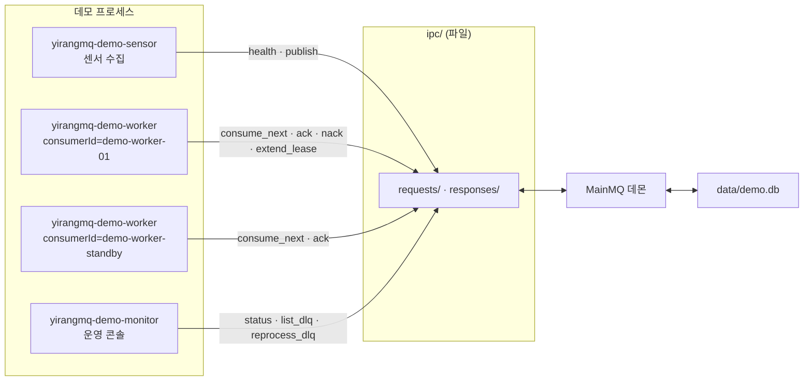
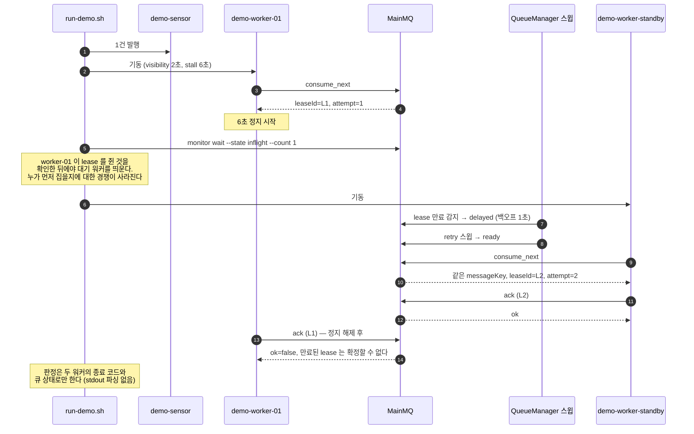

# yirangmq-demo — 동작 시연 예제

애플리케이션 계층 프로세스 세 개가 Yi-Rang MQ를 통해 실제로 통신하는 모습을 재현하는 시연용 예제입니다. 한 명령으로 6개 장면이 순서대로 돌아가고, 각 장면은 통과/실패로 판정됩니다.

```bash
cd build/out && ./run-demo.sh
```

가장 중요한 장면(처리 중 멈춘 워커의 메시지가 다른 워커에게 넘어가고, 늦은 확정이 거부되는 흐름)의 실제 출력입니다.

```text
══════════════════════════════════════════════════════════════
  장면 3 — 처리 중 멈춘 워커의 메시지가 다른 워커에게 넘어간다
══════════════════════════════════════════════════════════════
t+   0.1s  demo-sensor        발행 {"deviceId":"sensor-01","temp":24.0,"timestamp":1785861191}
t+   0.1s  demo-sensor             -> msg:telemetry:41F2-C136-8AF9-D3C8-9A0F
[..] worker-01 이 가시성 2초로 소비한 뒤 6초 멈춥니다
t+   0.1s  demo-worker-01     수신 attempt=1 msg:telemetry:41F2-C136-8AF9-D3C8-9A0F {...}
t+   0.1s  demo-worker-01     일부러 6000ms 멈춥니다 — 처리 중 정지 상황을 재현합니다
t+   0.1s  demo-monitor       ready=1 inflight=0 delayed=0 dlq=0
t+   0.4s  demo-monitor       ready=0 inflight=1 delayed=0 dlq=0
[..] 이제 대기 워커를 띄웁니다 — lease 가 만료되면 이쪽이 이어받아야 합니다
t+   0.1s  demo-worker-standby 대기 중 — 큐가 비어 있습니다 (오류가 아닙니다)
t+   2.6s  demo-monitor       ready=0 inflight=0 delayed=1 dlq=0
t+   4.1s  demo-worker-standby 수신 attempt=2 msg:telemetry:41F2-C136-8AF9-D3C8-9A0F {...}
t+   4.1s  demo-worker-standby 처리 완료 -> ack msg:telemetry:41F2-C136-8AF9-D3C8-9A0F
t+   4.8s  demo-monitor       ready=0 inflight=0 delayed=0 dlq=0
t+   6.1s  demo-worker-01     늦은 ack 거부됨 (기대한 결과) — ERR_INTERNAL_ERROR: ack rejected:
                              message is not inflight, or the lease is held by another consumer
t+   6.1s  demo-worker-01     만료된 lease 로는 확정할 수 없으므로 같은 작업이 두 번 반영되지 않습니다
[OK] 장면 3: 재배달로 대기 워커가 처리하고, 늦은 ack 은 거부되었습니다
```

`demo-monitor` 줄이 곧 상태 전이 타임라인입니다 — `inflight` → `delayed`(백오프) → `ready` → 재배달 → 정산 완료가 그대로 보입니다. 시간 값은 실행마다 조금씩 달라집니다.

장면 4의 재시도 소진도 같은 방식으로 눈에 보입니다.

```text
t+   0.1s  demo-worker-01     처리 실패 -> nack requeue=true (attempt=1)
t+   0.2s  demo-worker-01     처리 실패 -> nack requeue=true (attempt=2)
t+   0.3s  demo-worker-01     처리 실패 -> nack requeue=true (attempt=3)
t+   0.5s  demo-worker-01     처리 실패 -> nack requeue=true (attempt=4)
t+   0.6s  demo-worker-01     처리 실패 -> nack requeue=true (attempt=5)
t+   0.1s  demo-monitor       DLQ(telemetry) 1건
t+   0.1s  demo-monitor         msg:telemetry:F515-...  attempt=5  4초 전  사유: sensor fault: "transient"
```

`requeue=true`로 요청했는데도 5번째에 DLQ로 간 것은 큐 정책의 `retry.limit`이 5이기 때문입니다. 애플리케이션이 무한히 재시도를 요청해도 데몬이 막습니다.

---

## 기존 CLI 예제와 무엇이 다른가

`Samples/yirangmq-cli-publisher`와 `Samples/yirangmq-cli-consumer`는 이미 10개 명령 전부를 호출할 수 있고, `MailboxIPC::send_request()` 사용법의 참조로도 충분합니다. 다만 **한 번 실행에 한 요청**만 보내는 구조라 시연에는 세 가지가 걸립니다.

| 제약 | 근거 | 시연에서 생기는 문제 |
|------|------|---------------------|
| 1 프로세스 = 1 요청 | 두 CLI 모두 `main()`에서 명령 하나를 처리하고 종료 | 프로세스가 계속 대화하는 모습을 만들 수 없다. lease 만료 재배달을 보려면 사람이 시간을 세고 명령을 다시 쳐야 한다 |
| 키를 손으로 옮겨야 한다 | `cmd_consume`이 응답을 `data.dump(2)`로 출력하고 끝난다 (`yirangmq-cli-consumer/main.cpp:129`) | `messageKey`·`leaseId`를 눈으로 읽어 복붙해야 ack이 된다 |
| 출력이 순수 JSON이 아니다 | `Logger`가 `[타임스탬프][INFORMATION]` 접두사를 붙이고 산문이 섞인다 | `jq`로 바로 파싱할 수 없어, 자동 검증이 문자열 grep에 의존하게 된다 |

특히 **늦은 ack 거부(fencing)** 는 CLI만으로는 보여주기 어렵습니다. lease를 쥔 주체가 시간을 흘려보낸 뒤 확정을 시도해야 하는데, 1회성 프로세스에서는 그 주체가 이미 종료돼 있습니다.

그래서 이 예제는 **없는 것만 새로 만들고 되는 것은 재사용합니다.**

- 새로 만든 것: 상주 워커(`yirangmq-demo-worker`), 발행 프로세스(`yirangmq-demo-sensor`), 관측 콘솔(`yirangmq-demo-monitor`)
- 그대로 쓰는 것: 데몬(`MainMQ`), 설정(`main_mq_configuration.json`의 `telemetry` 큐), 그리고 손으로 확인할 때의 기존 CLI 두 개

설정 파일은 한 줄도 고치지 않습니다. 기본 큐 `telemetry`에 이미 스키마(`deviceId` 필수, `timestamp` 숫자)와 정책(`retry.limit` 5, `dlq.enabled`)이 등록되어 있어, 검증·재시도·DLQ가 전부 살아 있는 상태로 재현됩니다.

---

## 구성



| 프로그램 | 역할 | 호출하는 명령 |
|----------|------|--------------|
| `yirangmq-demo-sensor` | 텔레메트리 프레임을 발행한다. 다운스트림이 살아 있는지 신경쓰지 않는다 | `health`, `publish` |
| `yirangmq-demo-worker` | 상주 폴링 워커. `consume` → 판정 → `ack`/`nack`을 스스로 이어서 한다 | `consume_next`, `extend_lease`, `ack`, `nack` |
| `yirangmq-demo-monitor` | 큐 상태를 한 줄로 압축해 보여주고, 러너가 쓰는 상태 게이트를 제공한다 | `status`, `list_dlq`, `reprocess_dlq` |

세 프로그램은 `MqCall`을 공유합니다. `send_request()`의 2단 판정(전송 실패 시 `error`가 문자열, 명령 실패 시 `{code, message}` 객체)을 한 곳으로 모아 호출부를 단순하게 유지합니다.

---

## 실행

### 한 명령으로 전체

```bash
./build.sh
cd build/out && ./run-demo.sh
```

러너가 하는 일:

1. **`build/out`으로 이동한다.** IPC 루트(`./ipc`)가 작업 디렉터리 기준 상대 경로이므로, 이 이동이 없으면 데몬과 다른 디렉터리를 보게 되어 오류 없이 타임아웃만 발생합니다.
2. **데몬이 응답하는지 먼저 확인한다.** 있으면 그대로 쓰고, 없으면 `--db-path ./data/demo.db`로 띄웁니다. 같은 IPC 루트에 데몬이 둘이면 서로 요청을 가져가므로, 새로 띄우기 전에 반드시 확인합니다.
3. **6개 장면을 순서대로 재현하고 통과/실패를 집계한다.** 하나라도 실패하면 0이 아닌 코드로 종료합니다.

옵션:

```bash
./run-demo.sh --act 3      # 특정 장면만
./run-demo.sh --attach     # 이미 떠 있는 데몬에 붙는다 (새로 띄우지 않음)
./run-demo.sh --reset      # 데모 전용 데이터를 지우고 시작
./run-demo.sh --bin-dir /app   # Docker 안에서
```

### 손으로 따라가기

```bash
# 터미널 1 — 데몬
cd build/out && ./MainMQ

# 터미널 2 — 상태 관찰 (바뀔 때만 한 줄씩 찍힌다)
cd build/out && ./yirangmq-demo-monitor watch

# 터미널 3 — 워커 상주
cd build/out && ./yirangmq-demo-worker --consumer-id demo-worker-01

# 터미널 4 — 센서 발행
cd build/out && ./yirangmq-demo-sensor --count 5

# 터미널 4 — 처리 중 멈춘 워커 재현: 가시성 2초로 잡고 6초 멈춘다
cd build/out && ./yirangmq-demo-worker --consumer-id demo-worker-02 --visibility 2 --stall-ms 6000

# 파일이 통신 채널이라는 증거
ls -R build/out/ipc
sqlite3 build/out/data/demo.db \
  "select message_key, state, attempt, lease_consumer_id, target_consumer_id from msg_index;"
```

기존 CLI와 섞어 써도 됩니다. 예를 들어 발행은 `yirangmq-cli-publisher`로 하고 소비는 데모 워커가 받게 할 수 있습니다.

---

## 장면

| 장면 | 무엇을 보여주는가 | 합격 판정 |
|------|------------------|-----------|
| 1 | 발행 → 소비 → ack 정상 흐름 | 3건 발행, 워커가 3건 ack, `ready`가 0으로 |
| 2 | 스키마 위반 프레임은 발행 시점에 거부된다 | `ERR_VALIDATION_FAILED`로 거부되고 `ready`가 늘지 않음 |
| 3 | 처리 중 멈춘 워커의 메시지가 다른 워커에게 넘어가고, 늦은 ack은 거부된다 | 멈춘 워커의 ack이 거부됨 + 대기 워커가 재배달분을 ack |
| 4 | 반복 실패한 메시지가 DLQ로 격리된다 | `nack requeue=true`가 정책 한도에 닿아 `dlq`가 1로 |
| 5 | 원인을 조치한 뒤 DLQ 메시지를 재투입한다 | `reprocess_dlq` 후 `attempt` 초기화, 정상 처리, `dlq`가 0으로 |
| 6 | 지정한 워커만 받을 수 있다 | 대상이 아닌 워커는 끝까지 못 받고, 지정 워커가 처리 |

### 장면 3을 결정적으로 만드는 방법

가장 중요한 장면이면서 타이밍에 가장 민감합니다. 러너는 `sleep` 상수 대신 **데몬이 보고하는 상태**로 순서를 잡습니다.



대기 워커를 나중에 띄우는 것이 핵심입니다. 둘을 동시에 띄우면 어느 쪽이 먼저 `consume_next`를 보낼지 알 수 없어 장면이 흔들립니다.

재배달까지 걸리는 시간은 `가시성 2초 + lease 스윕 ≤1초 + 백오프 1초 + retry 스윕 ≤1초`로 통상 3~5초이고, 멈춘 워커의 ack은 6초 뒤이므로 항상 그 뒤에 옵니다.

---

## 옵션

### yirangmq-demo-sensor

| 옵션 | 설명 | 기본값 |
|------|------|--------|
| `--queue <name>` | 큐 이름 | `telemetry` |
| `--count <n>` | 발행 건수 | 3 |
| `--interval-ms <ms>` | 발행 간격 | 250 |
| `--device-id <id>` | 프레임의 `deviceId` | `sensor-01` |
| `--priority <n>` | 우선순위 | 0 |
| `--target <id>` | 지정 배달 대상 `consumerId` | 없음 = 아무 워커 |
| `--bad-frame <index>` | 이 인덱스 프레임에서 `deviceId`를 빼 스키마 검증 실패를 유도 | -1 = 없음 |
| `--fault-frame <index>` | 이 인덱스 프레임에 `fault` 필드를 넣어 워커가 실패 판정하게 한다 | -1 = 없음 |
| `--ipc-root <path>` / `--client-id <id>` / `--timeout <ms>` | IPC 설정 | `./ipc` / `demo-sensor` / 5000 |

### yirangmq-demo-worker

| 옵션 | 설명 | 기본값 |
|------|------|--------|
| `--consumer-id <id>` | `consumerId` 이자 `clientId` — lease 소유자 | `demo-worker-01` |
| `--visibility <sec>` | 소비 시 가시성 타임아웃 | 30 |
| `--poll-ms <ms>` | 큐가 비었을 때 재시도 간격 | 250 |
| `--idle-exit-ms <ms>` | 이 시간만큼 비어 있으면 정상 종료 | 0 = 무한 |
| `--max-messages <n>` | 이만큼 정산하면 종료 | 0 = 무제한 |
| `--work-ms <ms>` | 작업 시간 시뮬레이션. lease가 모자라면 `extend_lease` 호출 | 0 |
| `--stall-ms <ms>` | lease를 쥔 채 멈춘 뒤 ack을 시도한다 | 0 |
| `--ignore-fault` | `fault` 필드가 있어도 정상 처리한다 (정비 후 재투입) | 꺼짐 |

### yirangmq-demo-monitor

| 명령 | 설명 |
|------|------|
| `watch` | 상태가 바뀔 때만 한 줄씩 출력 (기본) |
| `once` | 현재 상태 + 정책 등록 여부 |
| `dlq` | DLQ 목록 표 |
| `reprocess --message-key <key>` / `--first` | DLQ 메시지를 `ready`로 되돌린다 |
| `wait --state <s> --count <n>` | 해당 상태가 `n` 이상이 될 때까지 대기 (러너 게이트) |
| `wait --state <s> --max <n>` | 해당 상태가 `n` 이하가 될 때까지 대기 |

---

## 코드에서 확인할 지점

`MqCall.cpp`가 통합 시 걸리는 계약을 한 곳에 모아 두었습니다.

| 계약 | 어디서 |
|------|--------|
| 2단 판정 — 전송 실패와 명령 실패에서 `error`의 타입이 다르다 | `MqCall.cpp`의 `call()` |
| `publish`의 `message`는 객체가 아니라 `dump()`한 문자열 | `Sensor.cpp` |
| 빈 큐는 오류가 아니다 — `ok == true && data["message"].is_null()` | `Worker.cpp` |
| `attempt`는 단수 | `Worker.cpp` |
| `nack`의 `requeue`는 기본 `false`이므로 재시도를 원하면 명시한다 | `Worker.cpp` |
| `consumerId`는 정확히 일치해야 하고, `clientId`와 같은 값을 쓰는 것이 안전하다 | `Worker.cpp` |
| `extend_lease` 응답에 새 만료 시각이 없어 직접 계산해야 한다 | `Worker.cpp` |
| 미등록 큐는 `ERR_QUEUE_NOT_FOUND`가 아니라 `ok=true` + `policy` 키 없음 | `Monitor.cpp`의 `read_status()` |

출력은 `Utilities::Logger` 대신 `std::cout`을 씁니다. 여러 프로세스가 같은 터미널에 쓰는 시연에서 로그 접두사(날짜·마이크로초·레벨)가 흐름을 가리기 때문이며, 데몬과 CLI는 그대로 `Logger`를 사용합니다.

---

## 다루지 않는 것

경계를 명확히 두었습니다.

- **TTL 퍼지** — `telemetry`의 `ttlSec`이 0이고 발행 payload에 TTL 키가 없어, 보여주려면 설정을 고쳐야 합니다. 복붙 실행 원칙에 반하므로 제외했습니다.
- **`batch_publish` / `batch_consume`** — `message`의 타입이 `publish`와 정반대(객체 vs 문자열)라 예제에 넣으면 오히려 혼란스럽습니다.
- **FileSystem / Hybrid 백엔드** — 기본 `sqlite`로만 검증했습니다. 다른 백엔드로 돌리려면 설정의 `backend`를 바꾸십시오. 오류 문구는 백엔드마다 다를 수 있습니다.
- **경로 탈출 방어, 손상 요청 격리** — 데몬의 방어 동작이며 정상 흐름 시연과 다른 축입니다.
